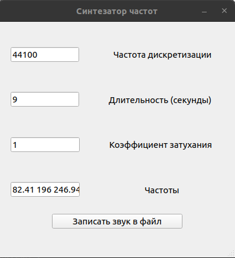

# synthesis-task
Простой синтезатор частот с GUI, созданный в качестве тестового задания.

В графу "Частоты" значения вводятся через пробел.

Изображение интерфейса: 

**metallica_test.wav** - это вступление знаменитой песни *Metallica - Nothing Else Matters*, сгенерированное этим синтезатором.
Эта бесспорная классика была сгенерирована с такими входными данными: частота дискретизации = 44100, длительность = 9 секунд, 
коэффициент затухания = 1, частоты = [82.41 196 246.94 329.63 246.94 196 82.41 196 246.94 329.63 246.94 196 82.41 196 246.94 329.63 246.94 196].